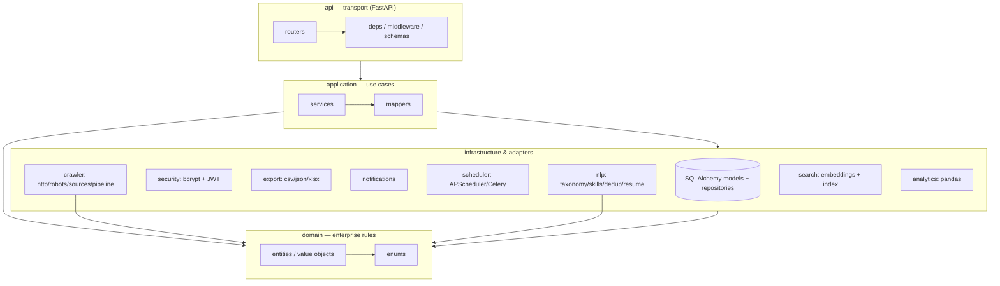
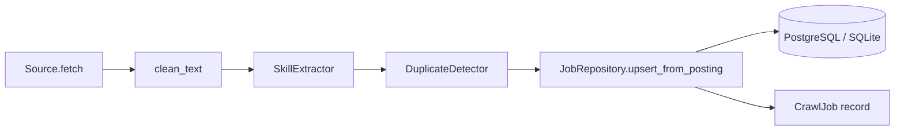
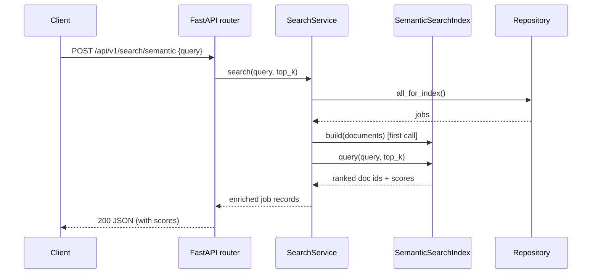
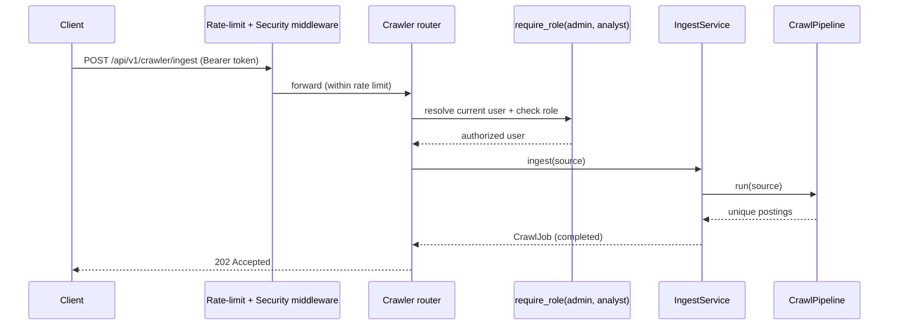

# Architecture

The platform follows **Clean Architecture**: dependencies point inwards, and the
domain core has no knowledge of the web framework, the database, or any external
service. This keeps business rules independently testable and lets
infrastructure choices (SQLite ↔ PostgreSQL, TF-IDF ↔ transformers, APScheduler
↔ Celery) change without touching the core.

## Layers

**Dependency rule:** `domain` imports nothing from the outer layers.
`application` depends on `domain` and orchestrates `infrastructure` through
narrow repository/service interfaces. `api` is a thin adapter that validates
input, calls a service, and serialises the result.

## Ingestion data flow

A `Source` yields raw-but-structured `JobPosting` domain objects. The
`CrawlPipeline` cleans the text, extracts canonical skills, drops exact and
near-duplicates, and the `IngestService` upserts them (deduplicating on a
content hash) while recording a `CrawlJob` for observability.

## Request sequence — semantic search

## Request sequence — authenticated crawl

## Cross-cutting concerns

- **Configuration** — `config.py` (pydantic-settings). Secrets from env only;
  production refuses placeholder secrets.
- **Logging** — `logging.py` (structlog), with a processor that redacts
  sensitive keys (`password`, `token`, `secret_key`, …) before any sink.
- **Errors** — a single `JMIError` hierarchy is mapped to HTTP responses by
  `api/errors.py`; unexpected exceptions never leak internals.
- **Extensibility** — new job portals are added by subclassing `BaseSource` and
  registering with `@registry.register`; the taxonomy is data-driven and can be
  extended from an external JSON file.
