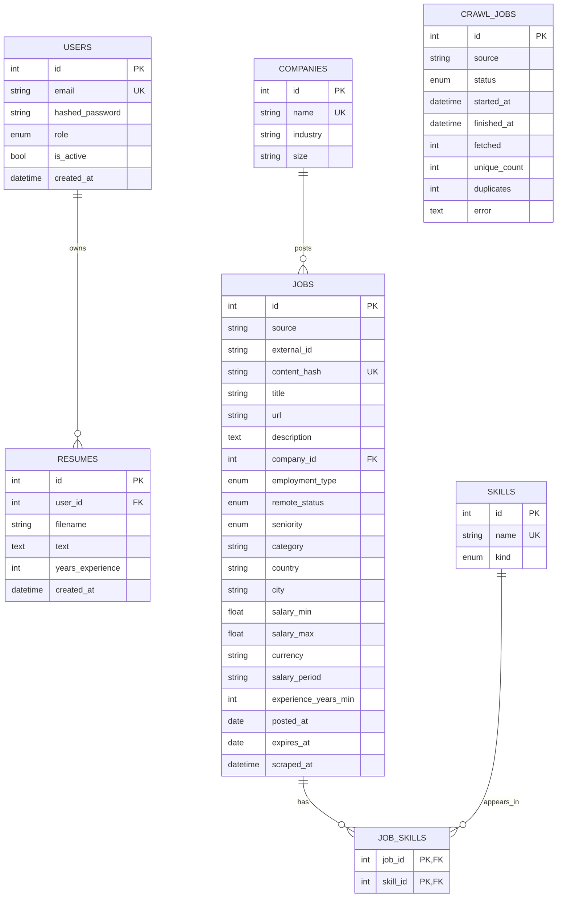

# Entity-Relationship Diagram

The schema is normalised around the natural entities of the domain. Companies
and skills are shared across jobs (foreign key / many-to-many); location and
salary are stored on the job row as a deliberate, read-optimised denormalisation
for the analytics workload.

## Constraints & indexes

- `jobs (source, external_id)` — unique together (a source's stable id).
- `jobs.content_hash` — unique; the deduplication key (SHA-256 of normalised
  title + company + location + description prefix).
- Indexed for query performance: `jobs.remote_status`, `jobs.category`,
  `jobs.country`, `jobs.city`, `jobs.title`, `companies.name`, `skills.name`,
  `users.email`.
- Foreign keys use `ON DELETE CASCADE` where a child cannot exist without its
  parent (`job_skills`, `resumes`).

Migrations are managed with **Alembic** (`jmi[postgres]` extra); for the SQLite
quick-start the schema is created automatically on startup.
